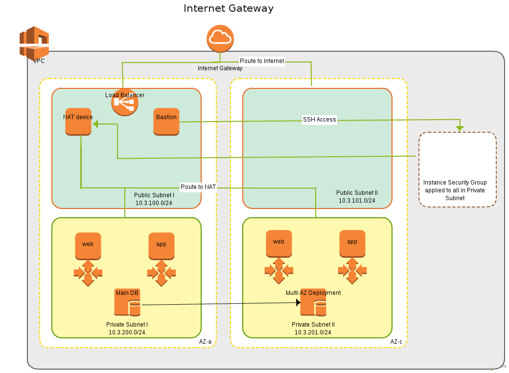

This VPC template is based on the Cloudformation [Office hours of 20140213](https://github.com/evandbrown/aws-hangouts/blob/master/20140213_cfn/README.md) by Evan Brown.

### Run It

 After adjusting the values in launch-params.json, just run: 
 
    git clone https://github.com/acoma58/scaffold
    cd scaffold
    (adjust launch-params.json)

    bash run.sh <stack name>

### Visualize It
Here's an architecture diagram of the resulting VPC:

### Grok It
This cloudformation template sets up a secured VPC with public and private subnets in two Availability Zones (AZ).

In the first public subnet (10.3.100.0/24), a Bastion host, a NAT device, and a load balancer are instantiated. The second public subnet (10.3.101.0/24) is not used, but could be used for high availability NAT, and Bastion.

 The Private subnets (10.3.200.0/24, and 10.3.201.0/24) host the instances, in this case, an autoscaling web instance, an autoscaling application instance, and finally the multi-AZ database instances. The autoscaling and database instances are presently configured via the console, but they could easily be instantiated by additional cloudformation templates. The important point is that the instances are all wrapped in the Instance Security Group which limits access to ssh from the bastion, http from the ELB and external access through the NAT device.
